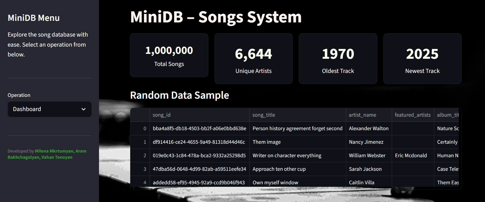

# ***MiniDB - Songs System***



### **In-Memory Data Management System**

MiniDB is a scalable in-memory database system designed to manage datasets containing over one million records efficiently.

The system supports:
- Fast indexed search using AVL trees
- Record insertion, deletion, and updates
- Range and compound queries
- Graph-based relationship analysis
- Statistical analytics and Top-K operations

The project was developed for the DS115: Data Structures & Algorithms in Data Science course at the American University of Armenia.
### ***Features***

#### Core Operations:
>- Search by attribute
>- Range search
>- Insert records
>- Delete records
>- Update records
>- Compound AND/OR search

#### Indexing:
>- AVL trees for fast lookup and range queries
>- Automatic index updates on insert, delete, update

#### Graph Features:
>- Construction from relational fields
>- BFS
>- Shortest path
>- Connected components

#### Analytics:
>- Min, max, average
>- Median
>- Top-K

User Interface:
Minimal Streamlit interface to run queries and display results.

Dataset:
- Over 1,000,000 generated records
- 5–8 attributes per record
- Includes relational fields for graph features

## System Structure

```text
storage.py        # Raw in-memory storage
indexing.py       # AVL tree implementation
query_engine.py   # Search, insert, delete, update, range queries
graph.py          # Graph algorithms
analytics.py      # Statistics and Top-K operations
app.py            # Streamlit UI
main.py           # Test script
README.md
requirements.txt
Dataset Report.pdf
Documentation.txt
```

## How to Run

### 1. Install dependencies
```bash
pip install -r requirements.txt
```

### 2. Run the Streamlit UI
```bash
streamlit run app.py
```

Documentation:
Full technical documentation is included in Documentation.txt and
Dataset Report.pdf, requirements.txt lists the dependencies.

## Credits

* Background by [Jason Dent](https://images.unsplash.com/photo-1580152317379-422c5221755e?q=80&w=1331&auto=format&fit=crop) on [Unsplash](https://unsplash.com)
* Work done in cooperation with Milena Mkrtumyan and Aram Bakhchagulyan